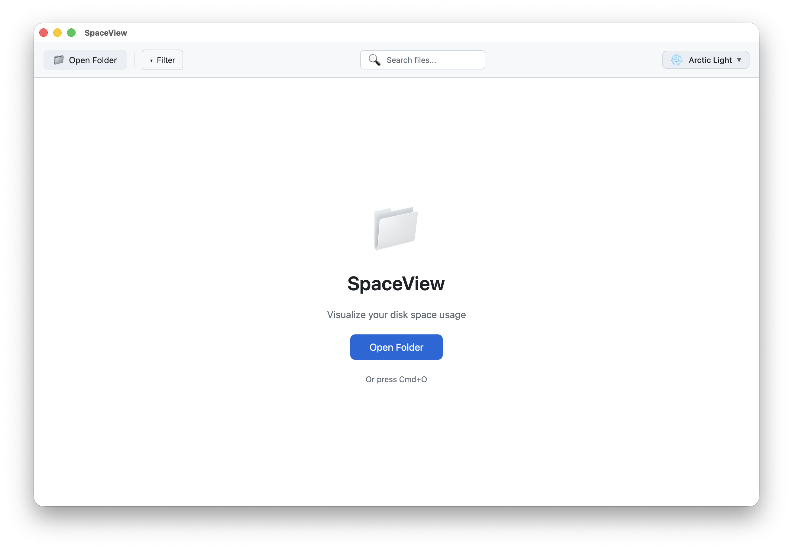

# SpaceView

<p align="center">
  
</p>

<p align="center">
  <strong>High-performance disk space analyzer for macOS</strong>
</p>

<p align="center">
  <a href="#features">Features</a> •
  <a href="#installation">Installation</a> •
  <a href="#usage">Usage</a> •
  <a href="#tech-stack">Tech Stack</a> •
  <a href="#development">Development</a>
</p>

---

## Screenshots

<p align="center">
  
</p>

## Features

- **Treemap Visualization** - Interactive squarified treemap showing file/folder sizes at a glance
- **Blazing Fast Scanning** - Parallel file system traversal using work-stealing algorithms (~70k files/sec)
- **Smart Caching** - Instant reload on subsequent visits with disk-based cache
- **Hardlink Deduplication** - Accurate size calculation that doesn't double-count hardlinked files
- **Multiple Themes** - 6 beautiful themes including Arctic Light, Midnight Dark, Cyberpunk, Ocean Deep, Forest, and Sunset
- **File Type Filtering** - Filter by documents, images, videos, audio, archives, code, and more
- **Search** - Quickly find files by name
- **File Operations** - Open files, reveal in Finder, or delete directly from the app

## Performance

Tested on a MacBook Pro scanning ~/Desktop with 1.4M+ files:

| Metric | Value |
|--------|-------|
| Files scanned | 1,450,000+ |
| Scan speed | ~70,000 files/sec |
| Total scan time | ~40s (first scan) |
| Cached reload | Instant (<1s) |
| Memory usage | ~1.7 GB peak |

## Installation

### Download

Download the latest release from the [Releases](https://github.com/majiayu000/spaceview/releases) page.

### Build from Source

```bash
# Clone the repository
git clone https://github.com/majiayu000/spaceview.git
cd spaceview

# Install dependencies
pnpm install

# Run in development mode
pnpm tauri:dev

# Build for production
pnpm tauri build
```

## Usage

1. Launch SpaceView
2. Click "Open Folder" or press `Cmd+O` to select a directory
3. Wait for the scan to complete (progress is shown in real-time)
4. Explore the treemap:
   - **Click** on a folder to zoom in
   - **Right-click** for context menu (Open, Reveal in Finder, Delete)
   - Use the **breadcrumb navigation** to go back
   - Use **Filter** to show only specific file types
   - Use **Search** to find files by name
5. Switch themes using the dropdown in the top-right corner

## Tech Stack

- **Frontend**: React 19 + TypeScript + Vite
- **Backend**: Rust + Tauri 2.0
- **Styling**: CSS Variables for theming
- **Algorithms**:
  - Squarified Treemap layout
  - Work-stealing parallel traversal (via `ignore` crate)
  - Lock-free concurrent data structures (`DashMap`, `DashSet`)
  - Bottom-up directory size calculation

## Architecture

```
SpaceView/
├── src/                    # React frontend
│   ├── App.tsx            # Main application component
│   ├── Treemap.tsx        # Treemap visualization
│   ├── ThemeSwitcher.tsx  # Theme selection
│   └── themes.ts          # Theme definitions
├── src-tauri/             # Rust backend
│   ├── src/
│   │   ├── lib.rs         # Tauri commands
│   │   ├── scanner.rs     # High-performance file scanner
│   │   └── cache.rs       # Scan result caching
│   └── Cargo.toml
└── package.json
```

## Key Optimizations

1. **Parallel Traversal**: Uses `ignore::WalkParallel` with work-stealing for optimal CPU utilization
2. **Lock-free Data Structures**: `DashMap` and `DashSet` for concurrent access without mutex contention
3. **Inode Tracking**: Tracks `(device_id, inode)` pairs to avoid counting hardlinks multiple times
4. **Streaming Progress**: Real-time progress updates via Tauri events
5. **Smart Tree Limits**: Configurable `MAX_CHILDREN`, `MAX_DEPTH`, and `MAX_TOTAL_NODES` to prevent memory issues
6. **Binary Cache**: Uses `bincode` for fast serialization/deserialization of scan results

## License

MIT License - see [LICENSE](LICENSE) for details.

## Acknowledgments

- [Tauri](https://tauri.app/) - Build cross-platform desktop apps
- [ignore](https://crates.io/crates/ignore) - Fast directory traversal
- [DashMap](https://crates.io/crates/dashmap) - Lock-free concurrent hashmap
- Inspired by [SpaceSniffer](http://www.intelia.it/SpaceSniffer/) and [WinDirStat](https://windirstat.net/)
